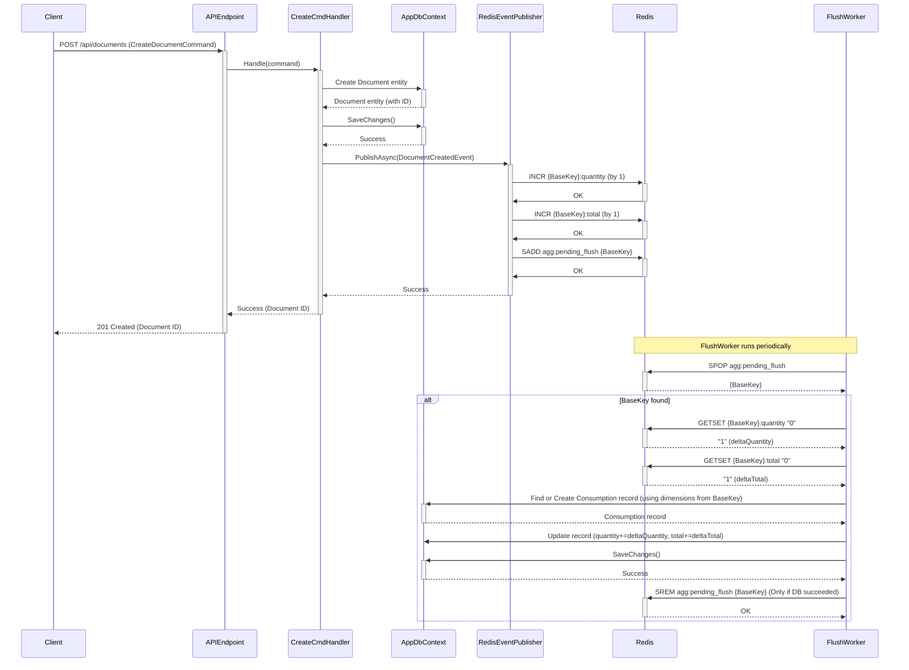

# Sequence Diagram: Document Create Flow

This diagram illustrates the sequence of events when a new document is created via the API.

**Key:**

*   `{BaseKey}`: Represents the specific aggregation key, e.g., `agg:company:123:2025-03-28:ws:nfe:ok`
