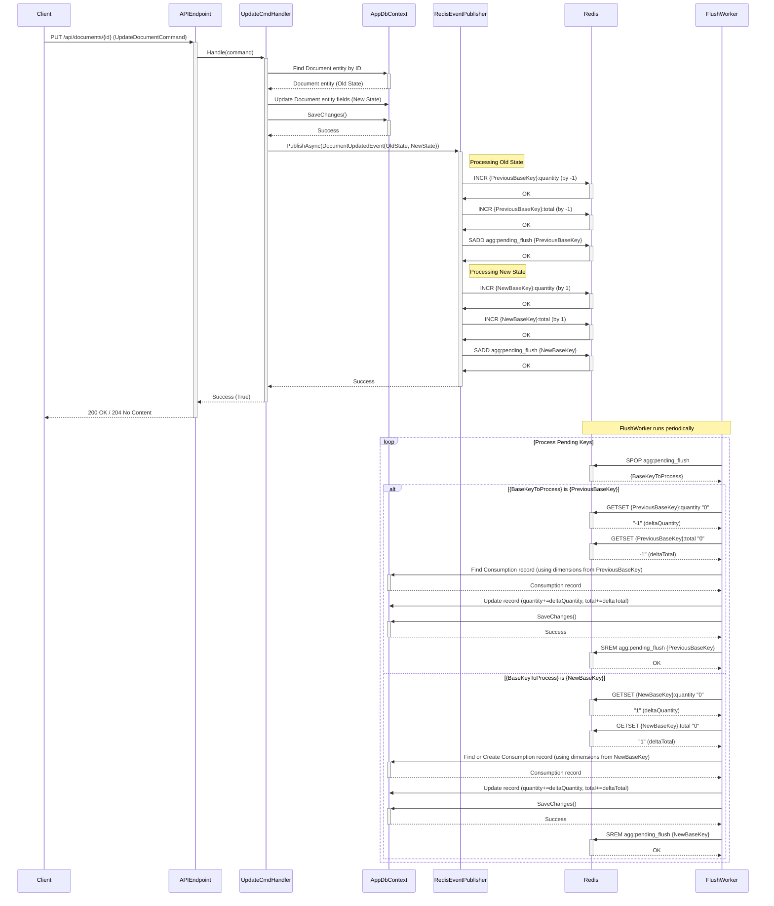

# Sequence Diagram: Document Update Flow (with Changes)

This diagram illustrates the sequence of events when an existing document is updated via the API, and the update involves changes to `CompanyId`, `Origin`, or `Status`.

**Key:**

*   `{PreviousBaseKey}`: Represents the aggregation key for the document's state *before* the update.
*   `{NewBaseKey}`: Represents the aggregation key for the document's state *after* the update.
*   Note: The total counter is decremented for the old state and incremented for the new state during updates, tracking state transitions accurately.
