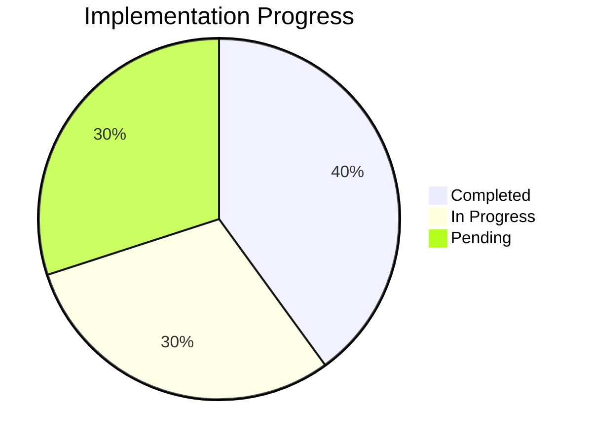
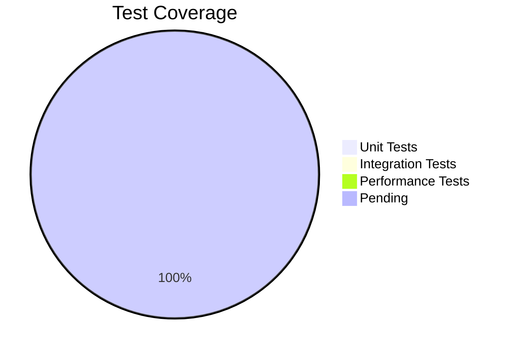
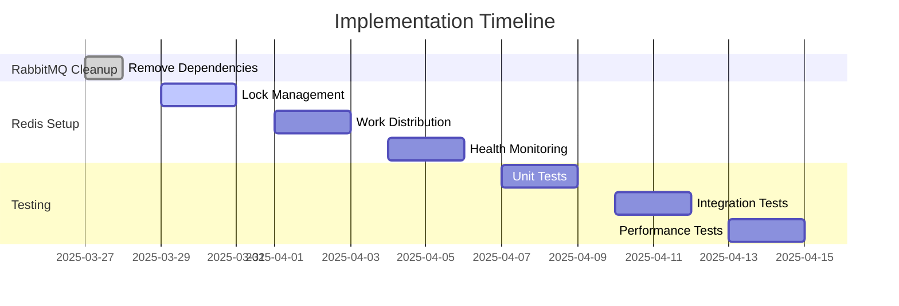

# Progress: NSdocs Document Consumption Module

## Current Status: Implementing Horizontally Scalable Redis Event Aggregation

### Completed Items
1. **Analysis & Planning**
   - Memory bank initialized
   - Requirements analyzed
   - Architecture designed
   - Implementation strategy defined

2. **Technical Decisions**
   - Switched from RabbitMQ to Redis-based aggregation
   - Designed distributed flusher coordination
   - CQRS pattern adoption
   - Testing strategy defined

3. **Database Analysis**
   - Existing schema reviewed
   - Migration approach defined
   - EF Core mapping planned
   - Performance considerations documented

4. **API Setup**
   - Solution structure created
   - Domain models implemented
   - EF Core configured
   - Complete CRUD operations implemented

5. **Event Publishing**
   - Document event classes created
   - Event publishing implemented in command handlers
   - In-memory event publisher implemented

6. **Database Migration**
   - Migration script created to drop triggers
   - Stored procedure kept for reference

7. **RabbitMQ Cleanup**
   - Removed NSdocs.Worker project
   - Cleaned up RabbitMQ dependencies
   - Updated configuration files
   - Removed RabbitMQEventPublisher

### Next Implementation Phase

#### 1. Lock Management
- [ ] Create RedisLockManager class
  - [ ] Implement lock acquisition
  - [ ] Add lock release
  - [ ] Support lock extension
  - [ ] Handle timeouts
  - [ ] Add unit tests

#### 2. Work Distribution
- [ ] Create WorkDistributor class
  - [ ] Add company assignment logic
  - [ ] Implement work claiming
  - [ ] Add redistribution support
  - [ ] Handle scaling events
  - [ ] Test distribution logic

#### 3. Health Monitoring
- [ ] Implement HealthMonitor
  - [ ] Add heartbeat system
  - [ ] Implement failure detection
  - [ ] Add failover handling
  - [ ] Test failure scenarios

#### 4. Flusher Service
- [ ] Update FlushWorker
  - [ ] Add instance registration
  - [ ] Implement coordination
  - [ ] Add graceful shutdown
  - [ ] Update processing logic
  - [ ] Test scaling scenarios

#### 5. Configuration & Deployment
- [ ] Add FlusherOptions
  - [ ] Configure timeouts
  - [ ] Set intervals
  - [ ] Add scaling settings
- [ ] Update docker-compose.yml
  - [ ] Add scaling support
  - [ ] Configure networking
  - [ ] Set environment variables

## Testing Progress

### Unit Tests
- [ ] RedisLockManager tests
- [ ] WorkDistributor tests
- [ ] HealthMonitor tests
- [ ] FlushWorker tests

### Integration Tests
- [ ] Multi-instance testing
- [ ] Failover scenarios
- [ ] Scaling operations
- [ ] Data consistency checks

### Performance Tests
- [ ] Lock contention
- [ ] Work distribution
- [ ] Failover timing
- [ ] Scale-out performance

## Current Progress Overview

## Implementation Timeline

## Success Metrics

### API Performance
- Response time < 200ms
- Throughput > 1000 req/s
- Error rate < 0.1%

### Event Processing
- Processing time < 100ms
- Redis operation latency < 10ms
- Zero data loss
- Sub-second failover

### Data Consistency
- Accurate consumption tracking
- Proper total calculations
- Consistent state across Redis and database
- No duplicate processing
