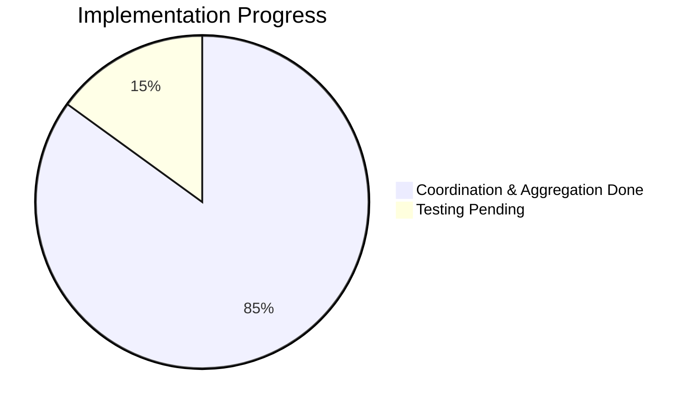
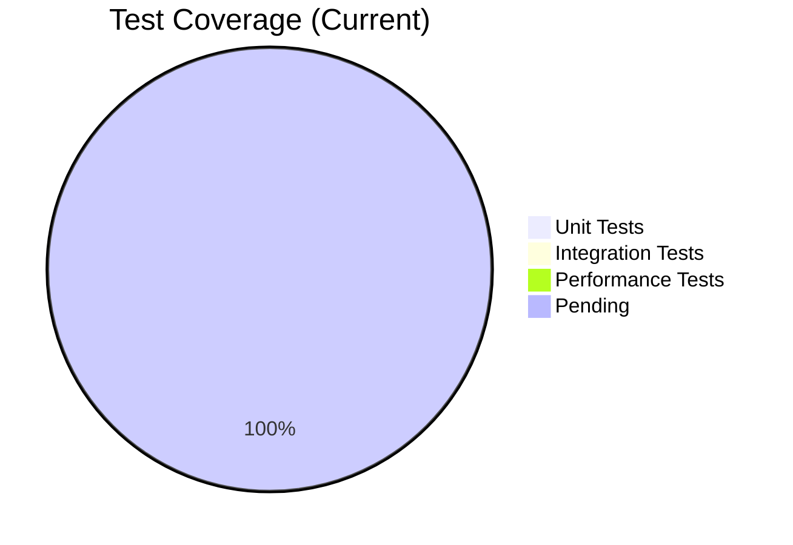
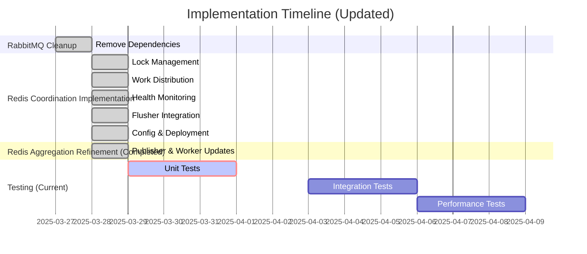

# Progress: NSdocs Document Consumption Module

## Current Status: Implementing Horizontally Scalable Redis Event Aggregation

### Completed Items
1. **Analysis & Planning**
   - Memory bank initialized
   - Requirements analyzed
   - Architecture designed
   - Implementation strategy defined

2. **Technical Decisions**
   - Switched from RabbitMQ to Redis-based aggregation
   - Designed distributed flusher coordination
   - CQRS pattern adoption
   - Testing strategy defined

3. **Database Analysis**
   - Existing schema reviewed
   - Migration approach defined
   - EF Core mapping planned
   - Performance considerations documented

4. **API Setup**
   - Solution structure created
   - Domain models implemented
   - EF Core configured
   - Complete CRUD operations implemented

5. **Event Publishing**
   - Document event classes created
   - Event publishing implemented in command handlers
   - In-memory event publisher implemented (Initial version)

6. **Database Migration**
   - Migration script created to drop triggers
   - Stored procedure kept for reference

7. **RabbitMQ Cleanup**
   - Removed NSdocs.Worker project
   - Cleaned up RabbitMQ dependencies
   - Updated configuration files
   - Removed RabbitMQEventPublisher

### Completed Implementation Phase: Redis Coordination

#### 1. Lock Management ✅
- [x] Create RedisLockManager class
  - [x] Implement lock acquisition (SET NX PX)
  - [x] Add lock release (Lua script)
  - [x] Support lock extension (Lua script)
  - [x] Handle timeouts (via TTL)
  - [ ] Add unit tests (Pending)

#### 2. Work Distribution ✅
- [x] Create WorkDistributor class
  - [x] Add company assignment logic (Consistent Hashing/Modulo)
  - [x] Implement work claiming (via GetAssignedWorkAsync)
  - [x] Add redistribution support (Trigger + Cleanup)
  - [x] Handle scaling events (Implicit via instance list changes)
  - [ ] Test distribution logic (Pending)

#### 3. Health Monitoring ✅
- [x] Implement HealthMonitor
  - [x] Add heartbeat system (Sorted Set score update)
  - [x] Implement failure detection (Score expiry check)
  - [x] Add failover handling (Trigger redistribution)
  - [x] Create HealthMonitorService (IHostedService wrapper)
  - [ ] Test failure scenarios (Pending)

#### 4. Flusher Service ✅
- [x] Update FlushWorker (Initial version with simple aggregation)
  - [x] Add instance registration (via WorkDistributor)
  - [x] Implement coordination (Get assigned work, lock companies)
  - [x] Add graceful shutdown (Release work)
  - [x] Update processing logic (Loop assigned work, use locks)
  - [ ] Test scaling scenarios (Pending)

#### 5. Configuration & Deployment ✅
- [x] Add FlusherSettings (appsettings.json)
  - [x] Configure intervals (Heartbeat, Expiry)
- [x] Update DI Registration (Read config, InstanceId logic)
- [x] Update docker-compose.yml
  - [x] Add scaling support (`deploy.replicas`)
  - [x] Pass HOSTNAME environment variable
- [x] Create Flusher Dockerfile

### Completed Phase: Redis Aggregation Refinement ✅

#### 1. RedisEventPublisher Update ✅
- [x] Modify `PublishAsync` to use granular keys (`agg:company:{id}:{date}:{origin}:{type}:{status}:quantity/total`).
- [x] Extract dimensions from `DocumentEventBase` (Used current UTC date).
- [x] Ensure consistent date/enum formatting in keys (yyyy-MM-dd, kebab-case).
- [x] Add logic to `SADD` the base key to `agg:pending_flush` set.

#### 2. FlushWorker Update ✅
- [x] Modify `ProcessPendingFlushSet` (renamed from `ProcessAssignedUpdates`) to process keys from `agg:pending_flush`.
- [x] Implement logic to fetch base keys from the set (using `SRANDMEMBER`+`SREM`).
- [x] Implement locking on the *base key*.
- [x] Implement parsing of dimensions from the base key string.
- [x] Modify DB logic to Find-Or-Create `Consumption` record using all dimensions (handling `DateOnly`/`DateTime`).
- [x] Adjust error handling/revert logic for the new flow.
- [x] Remove processed base key from `agg:pending_flush` on DB success.
- [x] Removed dependency on `IWorkDistributor`.

### Next Phase: Testing & Refinement (Current)

## Testing Progress (Post-Refinement)

### Unit Tests (Pending)
- [ ] RedisLockManager tests
- [ ] WorkDistributor tests
- [ ] HealthMonitor tests
- [ ] FlushWorker tests (Updated for new logic)
- [ ] RedisEventPublisher tests (Updated for new logic)

### Integration Tests (Pending)
- [ ] Multi-instance testing
- [ ] Failover scenarios
- [ ] Scaling operations
- [ ] Data consistency checks (including record creation)

### Performance Tests (Pending)
- [ ] Lock contention (base key locks)
- [ ] Work distribution (if changed)
- [ ] Failover timing
- [ ] Scale-out performance

## Current Progress Overview

## Implementation Timeline

## Success Metrics (Updated for Creation)

### API Performance
- Response time < 200ms
- Throughput > 1000 req/s
- Error rate < 0.1%

### Event Processing
- Processing time < 100ms
- Redis operation latency < 10ms
- Zero data loss
- Sub-second failover

### Data Consistency
- Accurate consumption tracking (Updates and Creation)
- Proper total calculations per dimension
- Consistent state across Redis and database
- No duplicate processing or lost updates
