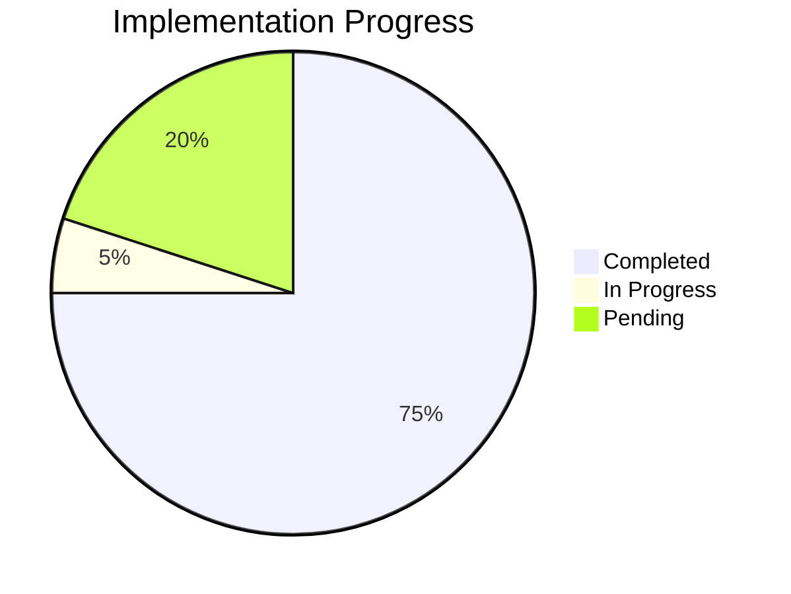
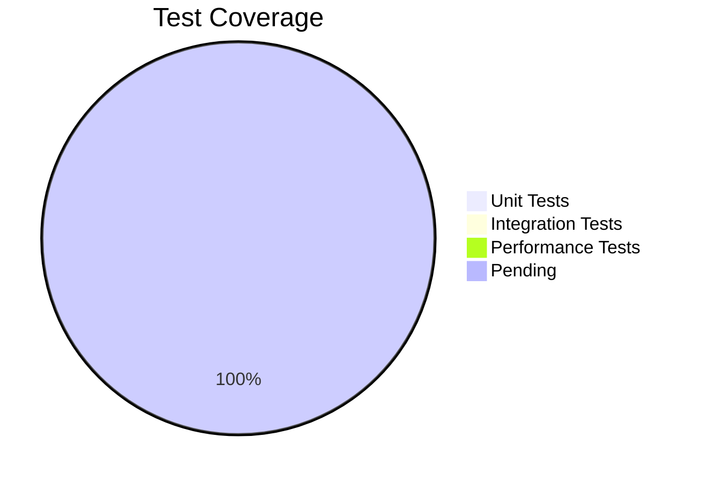
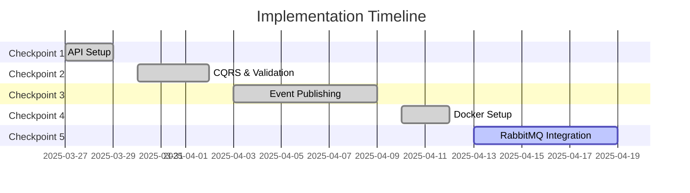

# Progress: NSdocs Document Consumption Module

## Current Status: Replacing MySQL Triggers with Event-Driven Architecture

### Completed Items
1. **Analysis & Planning**
   - Memory bank initialized
   - Requirements analyzed
   - Architecture designed
   - Implementation strategy defined

2. **Technical Decisions**
   - Event-driven architecture chosen
   - RabbitMQ integration planned
   - CQRS pattern adoption
   - Testing strategy defined

3. **Database Analysis**
   - Existing schema reviewed
   - Migration approach defined
   - EF Core mapping planned
   - Performance considerations documented

4. **API Setup**
   - Solution structure created
   - Domain models implemented
   - EF Core configured
   - Complete CRUD operations implemented

5. **Event Publishing**
   - Document event classes created
   - Event publishing implemented in command handlers
   - In-memory event publisher implemented
   - RabbitMQ event publisher placeholder created

6. **Database Migration**
   - Migration script created to drop triggers
   - Stored procedure kept for reference

7. **Worker Service**
   - Project structure created
   - Event consumer placeholder implemented
   - Configuration for RabbitMQ prepared

8. **Docker Setup**
   - Added RabbitMQ to docker-compose.yml
   - Configured connection settings in appsettings.json
   - Set up networking between services

### Next Implementation Phase
1. **Checkpoint 5: RabbitMQ Integration**
   - Implement RabbitMQ integration
   - Complete worker service implementation
   - Add integration tests for event processing

### Implementation Roadmap

#### Checkpoint 1: API Setup ✅
- [x] Solution Structure
  - [x] Create solution file
  - [x] Add project references
  - [x] Configure dependencies
  - Success: Solution builds successfully

- [x] Domain Models
  - [x] Document entity
  - [x] Consumption entity
  - [x] Enums implementation
  - Success: Models mirror database schema

- [x] Database Setup
  - [x] EF Core configuration
  - [x] Entity mappings
  - [ ] Initial migration
  - Success: Can connect and query database

- [x] CRUD Operations
  - [x] Create document
  - [x] Read documents
  - [x] Update document
  - [x] Delete document
  - Success: All CRUD operations working

#### Checkpoint 2: CQRS & Validation ✅
- [x] MediatR Setup
  - [x] Commands and queries
  - [x] Handlers implementation
  - [ ] Pipeline behaviors
  - Success: Command/query pattern working

- [x] Validation
  - [x] FluentValidation rules
  - [x] Custom validators
  - [ ] Unit tests
  - Success: Proper validation in place

#### Checkpoint 3: Event Publishing ✅
- [x] Event Classes
  - [x] Base event class
  - [x] Created event
  - [x] Updated event
  - [x] Deleted event
  - Success: Event classes defined

- [x] Event Publishing
  - [x] Event publisher interface
  - [x] In-memory implementation
  - [x] RabbitMQ placeholder
  - Success: Events published properly

- [x] Database Migration
  - [x] Drop triggers script
  - [x] Migration strategy
  - Success: Clean migration path

- [x] Worker Service Structure
  - [x] Project setup
  - [x] Consumer placeholder
  - [x] Configuration
  - Success: Worker service ready for implementation

#### Checkpoint 4: Docker Setup ✅
- [x] RabbitMQ Container
  - [x] Added to docker-compose.yml
  - [x] Configured ports and volumes
  - [x] Set up networking
  - Success: RabbitMQ available in container

- [x] Configuration
  - [x] Updated API appsettings
  - [x] Updated Worker appsettings
  - [x] Environment-specific settings
  - Success: Applications can connect to RabbitMQ

#### Checkpoint 5: RabbitMQ Integration
- [ ] MassTransit Integration
  - [ ] Install MassTransit packages
  - [ ] Configure MassTransit
  - [ ] Set up message consumers
  - Success: MassTransit properly configured

- [ ] Worker Implementation
  - [ ] Event consumers
  - [ ] Consumption update logic
  - [ ] Error handling
  - Success: Worker processes events correctly

- [ ] Integration Tests
  - [ ] Event publishing tests
  - [ ] Event consumption tests
  - [ ] End-to-end flow tests
  - Success: Events flow correctly

## Testing Progress

### Unit Tests
- [ ] Domain model tests
- [ ] Command/query tests
- [ ] Validation tests
- [ ] Repository tests
Target: 90% coverage

### Integration Tests
- [ ] API endpoint tests
- [ ] Event publishing tests
- [ ] Database operation tests
- [ ] Worker service tests
Target: Key workflows covered

### Performance Tests
- [ ] API response times
- [ ] Event processing speed
- [ ] Database operations
- [ ] Concurrent processing
Target: Meet SLA requirements

## Current Progress Overview

## Timeline

## Success Metrics

### API Performance
- Response time < 200ms
- Throughput > 1000 req/s
- Error rate < 0.1%

### Event Processing
- Processing time < 100ms
- Queue depth < 1000
- Zero event loss

### Data Consistency
- No missed updates
- Accurate consumption
- Consistent state
