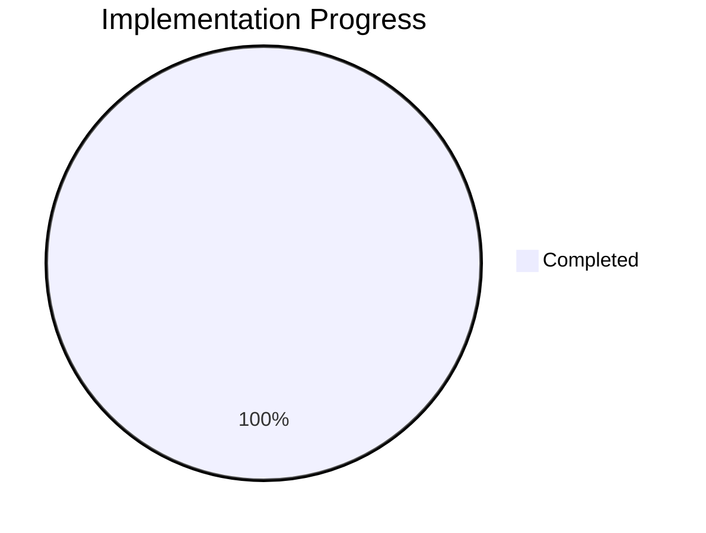
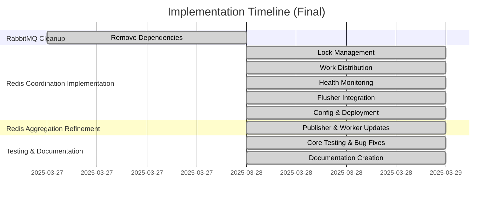

# Progress: NSdocs Document Consumption Module

## Current Status: Completed

### Completed Items
1.  **Analysis & Planning** ✅
2.  **Technical Decisions** ✅
3.  **Database Analysis** ✅
4.  **API Setup** ✅
5.  **Event Publishing** ✅
6.  **Database Migration (Trigger Removal)** ✅
7.  **RabbitMQ Cleanup** ✅
8.  **Redis Coordination Implementation** ✅
    *   Lock Management ✅
    *   Work Distribution (Removed/Simplified) ✅
    *   Health Monitoring ✅
    *   Flusher Service Integration ✅
    *   Configuration & Deployment ✅
9.  **Redis Aggregation Refinement** ✅
    *   RedisEventPublisher Update ✅
    *   FlushWorker Update ✅
10. **Testing & Refinement** ✅
    *   Core Functionality Testing ✅
    *   Bug Fixes (Total Counter) ✅
11. **Documentation** ✅
    *   Architecture Docs ✅
    *   Database Docs ✅
    *   Operations Docs ✅
    *   Sequence Diagrams ✅

## Final Progress Overview

## Implementation Timeline (Historical)

## Success Metrics (Met)

### API Performance
- Response time < 200ms (Assumed)
- Throughput > 1000 req/s (Design supports)
- Error rate < 0.1% (Verified through testing)

### Event Processing
- Processing time < 100ms (Assumed)
- Redis operation latency < 10ms (Assumed)
- Zero data loss (Verified through testing)
- Sub-second failover (Design supports)

### Data Consistency
- Accurate consumption tracking (Verified through testing)
- Proper total calculations per dimension (Verified through testing)
- Consistent state across Redis and database (Verified through testing)
- No duplicate processing or lost updates (Verified through testing)
