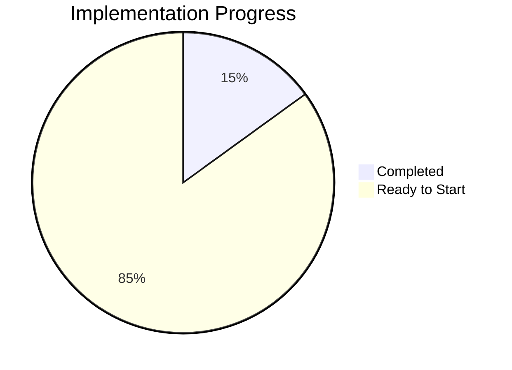
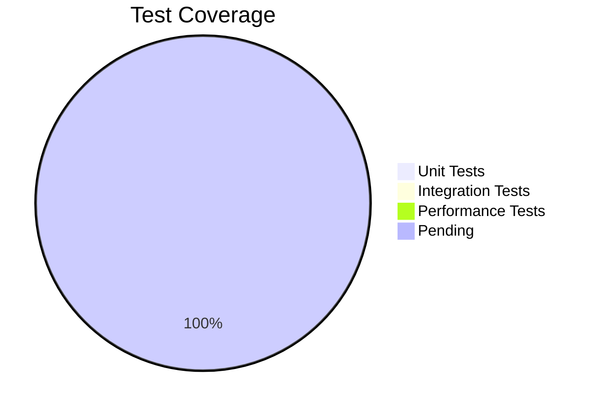
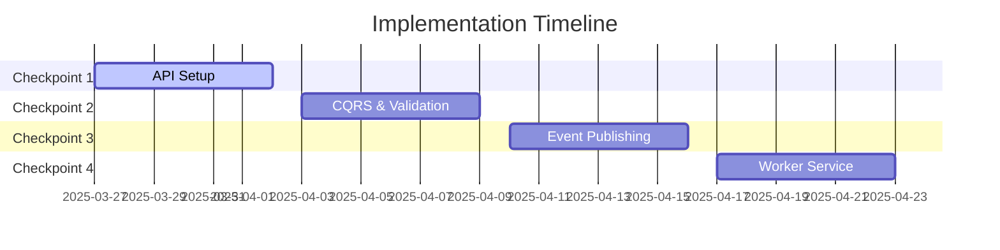

# Progress: NSdocs Document Consumption Module

## Current Status: Ready for Implementation

### Completed Items
1. **Analysis & Planning**
   - Memory bank initialized
   - Requirements analyzed
   - Architecture designed
   - Implementation strategy defined

2. **Technical Decisions**
   - Event-driven architecture chosen
   - RabbitMQ integration planned
   - CQRS pattern adoption
   - Testing strategy defined

3. **Database Analysis**
   - Existing schema reviewed
   - Migration approach defined
   - EF Core mapping planned
   - Performance considerations documented

### Next Implementation Phase
1. **Checkpoint 1: API Setup**
   - Create solution structure
   - Implement domain models
   - Configure EF Core
   - Basic CRUD operations

### Implementation Roadmap

#### Checkpoint 1: API Setup
- [ ] Solution Structure
  - [ ] Create solution file
  - [ ] Add project references
  - [ ] Configure dependencies
  - Success: Solution builds successfully

- [ ] Domain Models
  - [ ] Document entity
  - [ ] Consumption entity
  - [ ] Enums implementation
  - Success: Models mirror database schema

- [ ] Database Setup
  - [ ] EF Core configuration
  - [ ] Entity mappings
  - [ ] Initial migration
  - Success: Can connect and query database

- [ ] Repository Layer
  - [ ] Base repository
  - [ ] Document repository
  - [ ] Unit tests
  - Success: CRUD operations working

#### Checkpoint 2: CQRS & Validation
- [ ] MediatR Setup
  - [ ] Commands and queries
  - [ ] Handlers implementation
  - [ ] Pipeline behaviors
  - Success: Command/query pattern working

- [ ] Validation
  - [ ] FluentValidation rules
  - [ ] Custom validators
  - [ ] Unit tests
  - Success: Proper validation in place

#### Checkpoint 3: Event Publishing
- [ ] RabbitMQ Integration
  - [ ] MassTransit setup
  - [ ] Event publishing
  - [ ] Error handling
  - Success: Events published properly

- [ ] Integration Tests
  - [ ] Event publishing tests
  - [ ] End-to-end flow tests
  - Success: Events flow correctly

#### Checkpoint 4: Worker Service
- [ ] Consumer Setup
  - [ ] Event consumer
  - [ ] Processing logic
  - [ ] Error handling
  - Success: Events processed correctly

- [ ] Consumption Logic
  - [ ] Business rules
  - [ ] Database updates
  - [ ] Performance testing
  - Success: Accurate consumption tracking

## Testing Progress

### Unit Tests
- [ ] Domain model tests
- [ ] Command/query tests
- [ ] Validation tests
- [ ] Repository tests
Target: 90% coverage

### Integration Tests
- [ ] API endpoint tests
- [ ] Event publishing tests
- [ ] Database operation tests
- [ ] Worker service tests
Target: Key workflows covered

### Performance Tests
- [ ] API response times
- [ ] Event processing speed
- [ ] Database operations
- [ ] Concurrent processing
Target: Meet SLA requirements

## Current Progress Overview

### Development Status

### Testing Coverage

## Timeline

## Success Metrics

### API Performance
- Response time < 200ms
- Throughput > 1000 req/s
- Error rate < 0.1%

### Event Processing
- Processing time < 100ms
- Queue depth < 1000
- Zero event loss

### Data Consistency
- No missed updates
- Accurate consumption
- Consistent state
