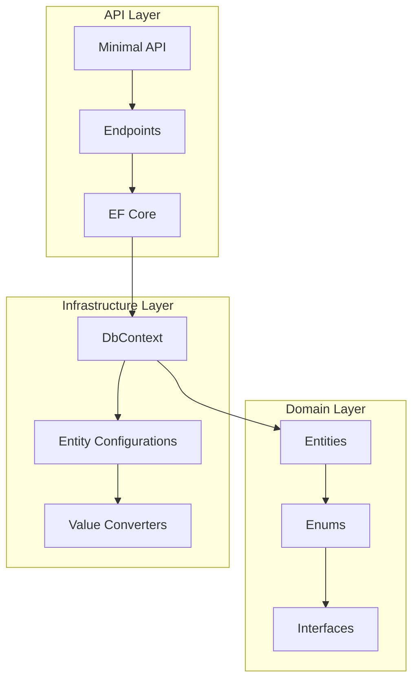
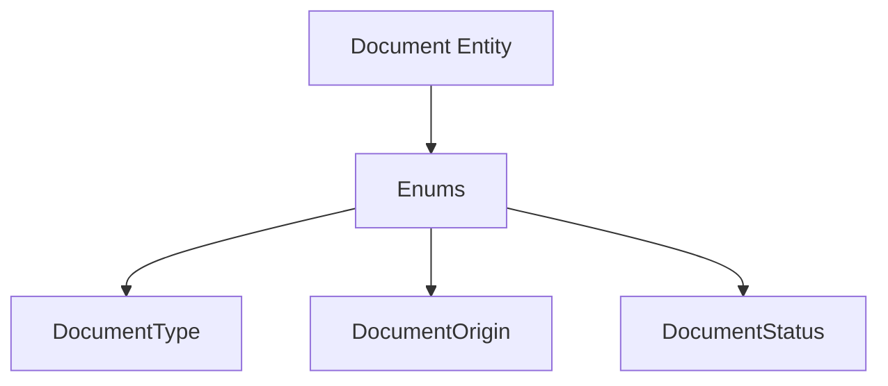
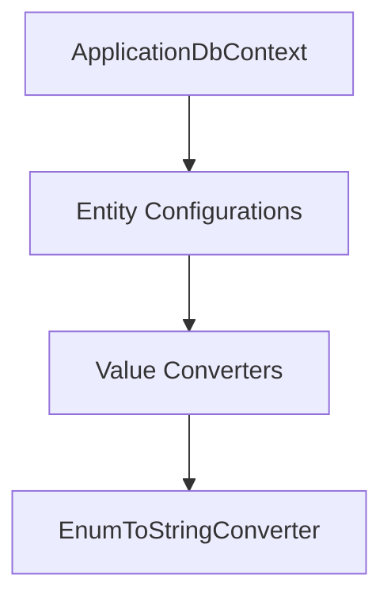
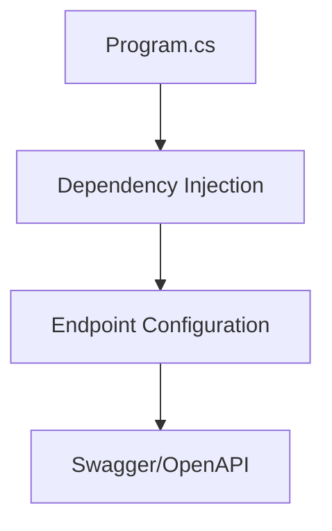
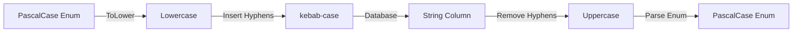

# System Patterns: NSdocs Document Consumption Module

## Architecture Overview



## Clean Architecture Implementation

### 1. Domain Layer


### 2. Infrastructure Layer


### 3. API Layer


## Design Patterns

### 1. Generic Value Converter
- `EnumToStringConverter<T>`: Handles enum-to-string mapping
- Automatic PascalCase to kebab-case conversion
- Reusable across all enum properties

### 2. Dependency Injection
- Infrastructure services in `AddInfrastructure()`
- Application services in `AddApplication()`
- Clean separation of concerns

### 3. Repository Configuration
- Fluent API configurations
- Strong typing with generics
- Consistent naming conventions

## Data Mappings

### Enum Mapping Strategy


### Entity Configuration
```csharp
// Example configuration pattern
builder.Property(x => x.EnumProperty)
    .HasColumnName("column_name")
    .HasConversion(new EnumToStringConverter<TEnum>())
    .IsRequired();
```

## API Documentation

### Endpoints
1. GET / - Welcome message
2. GET /health - Health check
3. GET /api/documents - List documents

### Documentation
- OpenAPI/Swagger UI at /docs
- JSON schema at /docs/v1/swagger.json

## Directory Structure
```
src/
├── NSdocs.API/
│   ├── Endpoints/
│   └── Program.cs
├── NSdocs.Domain/
│   ├── Entities/
│   └── Enums/
└── NSdocs.Infrastructure/
    ├── Data/
    │   ├── Configurations/
    │   └── Converters/
    └── DependencyInjection.cs
```
