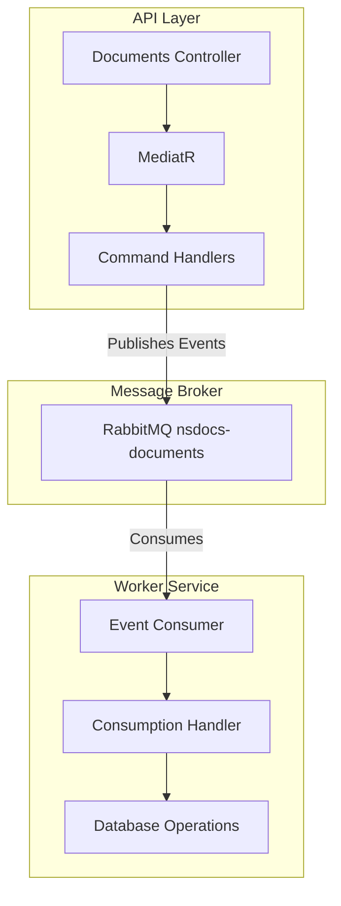
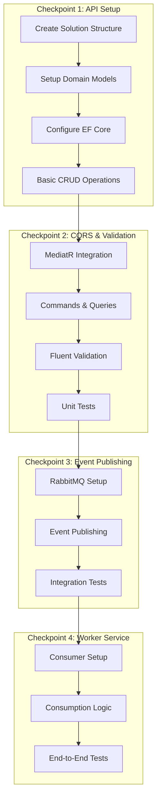
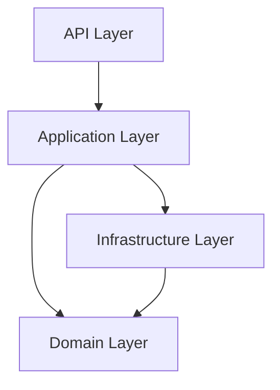
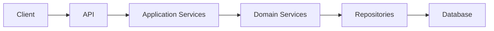

# System Patterns: NSdocs Document Consumption Module

## Architecture Overview



## Implementation Checkpoints



## Solution Structure

```
src/
├── NSdocs.API/              # API endpoints & controllers
├── NSdocs.Application/      # Commands, handlers & validation
├── NSdocs.Domain/          # Entities, events & interfaces
├── NSdocs.Infrastructure/  # Data access & messaging
├── NSdocs.Worker/          # Event consumer & handlers
tests/
├── NSdocs.UnitTests/
├── NSdocs.IntegrationTests/
```

## Domain Models

### Enums
```csharp
public enum EventType { Created, Updated, Deleted }
public enum DocumentOrigin { File, Email, Ws }
public enum DocumentType { Cfe, Cte, Cteos, Mdfe, Nfce, Nfe, Nfse }
public enum DocumentStatus { Ok, Pending, Error, NonExisting }
```

### Events
```csharp
public class DocumentEvent
{
    public EventType EventType { get; set; }
    public int CompanyId { get; set; }
    public DateTime RequestDate { get; set; }
    public DocumentOrigin Origin { get; set; }
    public DocumentType DocumentType { get; set; }
    public DocumentStatus Status { get; set; }
}
```

## Key Patterns

1. **CQRS with MediatR**
   - Commands for write operations
   - Queries for read operations
   - Validation using FluentValidation

2. **Event-Driven Architecture**
   - Document events published to RabbitMQ
   - Worker service for consumption updates
   - Decoupled processing

3. **Repository Pattern**
   - Entity Framework Core
   - Clean separation of concerns
   - Domain-driven design

## Design Patterns

### Domain Patterns
1. **Aggregates**
   - Document aggregate
   - Consumption aggregate
   - Company aggregate

2. **Value Objects**
   - AccessKey
   - ConsumptionPeriod
   - DocumentType
   - DocumentOrigin
   - DocumentStatus

3. **Domain Events**
   - DocumentRegistered
   - DocumentStatusChanged
   - ConsumptionUpdated

### Application Patterns
1. **CQRS**
   - Commands
     - RegisterDocument
     - UpdateDocumentStatus
     - DeleteDocument
   - Queries
     - GetDocumentById
     - GetCompanyConsumption
     - GetMonthlyReport

2. **Repository Pattern**
   - IDocumentRepository
   - IConsumptionRepository
   - Generic repository interface

3. **Unit of Work**
   - Transaction management
   - Concurrency handling
   - Data consistency

## Migration Strategy

### Phase 1: Infrastructure Setup
1. Create new .NET Core project structure
2. Set up Clean Architecture layers
3. Implement base patterns and interfaces
4. Configure development environment

### Phase 2: Domain Implementation
1. Create domain models
2. Implement business rules
3. Set up domain events
4. Define interfaces

### Phase 3: Database Migration
1. Create new database schema
2. Implement repositories
3. Set up data migration scripts
4. Validate data consistency

### Phase 4: API Development
1. Create REST endpoints
2. Implement authentication
3. Set up validation
4. Add API documentation

### Phase 5: Testing & Validation
1. Unit tests
2. Integration tests
3. Performance tests
4. Migration validation

## System Components

### Core Components


### Data Flow


### Event Flow
```mermaid
graph TD
    A[Document Registration] --> B[Domain Event]
    B --> C[Event Handler]
    C --> D[Consumption Update]
    D --> E[Status Change]
