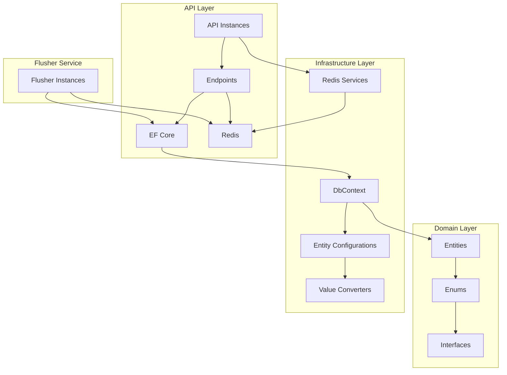
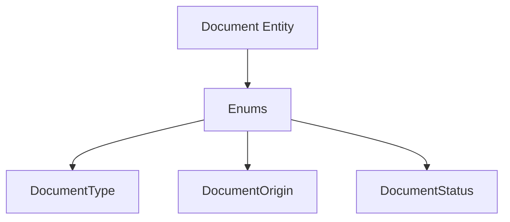
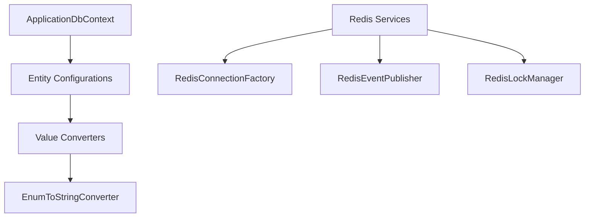
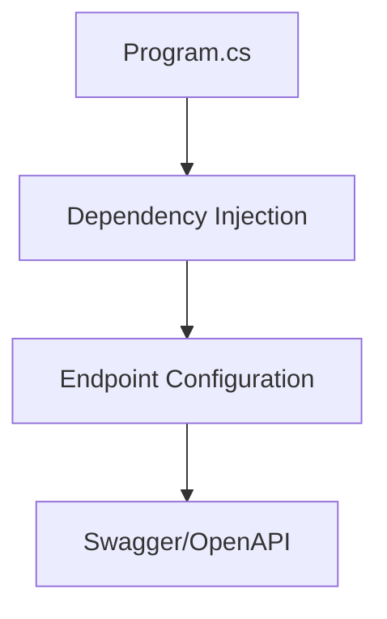
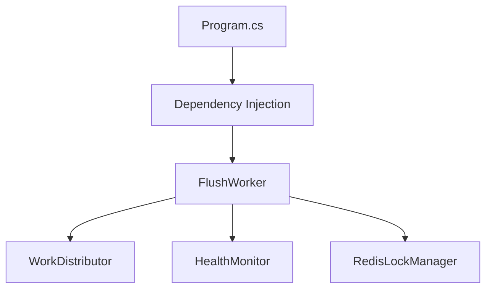
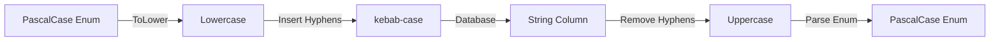

# System Patterns: NSdocs Document Consumption Module

## Architecture Overview



## Clean Architecture Implementation

### 1. Domain Layer


### 2. Infrastructure Layer


### 3. API Layer


### 4. Flusher Service Layer


## Design Patterns

### 1. Redis-Based Aggregation
- **API**: Writes deltas directly to Redis using atomic operations (`INCRBY`, `SADD`).
- **Redis Keys**: Structured keys for aggregation (`agg:company:{id}:{date}:{origin}:{type}:{status}:{metric}`).
- **Flusher**: Periodically reads aggregated values, updates the database, and resets Redis counters.

### 2. Distributed Flusher Coordination
- **Goal**: Allow multiple flusher instances to run concurrently without conflicts.
- **Components**:
    - `RedisLockManager`: Provides distributed locking using Redis `SET NX PX`.
    - `WorkDistributor`: Assigns companies to specific flushers based on hashing.
    - `HealthMonitor`: Detects failed flushers via heartbeats and triggers work redistribution.
- **Protocol**: Flushers register, claim work, acquire locks per company, process, and release locks.

### 3. Database Contention Mitigation (Flusher)
- **Optimize Updates**: Ensure efficient `UPDATE` statements on the `consumption` table using proper indexing (`uk_company_type_origin_date_status`).
- **Reduce Lock Scope**: Use row-level locking (InnoDB default) and keep database transactions short (fetch from Redis first, then transact DB update, commit, then update Redis state).
- **Batching (Optional)**: Consider batching multiple company updates within a single flusher transaction if needed, balancing throughput vs. lock duration.
- **Connection Pooling**: Utilize EF Core's connection pooling effectively.
- **Monitoring**: Track database lock waits, transaction times, and deadlocks.

### 4. Generic Value Converter
- `EnumToStringConverter<T>`: Handles enum-to-string mapping.
- Automatic PascalCase to kebab-case conversion.
- Reusable across all enum properties.

### 5. Dependency Injection
- Services registered in respective layers (`AddInfrastructure`, `AddApplication`, Flusher DI).
- Clean separation of concerns.

### 6. Repository Configuration
- Fluent API configurations for EF Core entities.
- Strong typing with generics.
- Consistent naming conventions.

## Data Mappings

### Enum Mapping Strategy


### Entity Configuration
```csharp
// Example configuration pattern
builder.Property(x => x.EnumProperty)
    .HasColumnName("column_name")
    .HasConversion(new EnumToStringConverter<TEnum>())
    .IsRequired();
```

## API Documentation

### Endpoints
1. GET / - Welcome message
2. GET /health - Health check
3. GET /api/documents - List documents (CRUD endpoints)

### Documentation
- OpenAPI/Swagger UI at /docs
- JSON schema at /docs/v1/swagger.json

## Directory Structure
```
src/
├── NSdocs.API/
│   ├── Endpoints/
│   └── Program.cs
├── NSdocs.Application/
│   ├── Commands/
│   ├── Queries/
│   └── Common/Interfaces/
├── NSdocs.Domain/
│   ├── Entities/
│   └── Enums/
├── NSdocs.Infrastructure/
│   ├── Data/
│   │   ├── Configurations/
│   │   └── Converters/
│   ├── Services/ (Redis, Locking)
│   └── DependencyInjection.cs
└── NSdocs.Flusher/
    ├── Workers/ (FlushWorker)
    ├── Services/ (Distributor, Monitor)
    └── Program.cs
